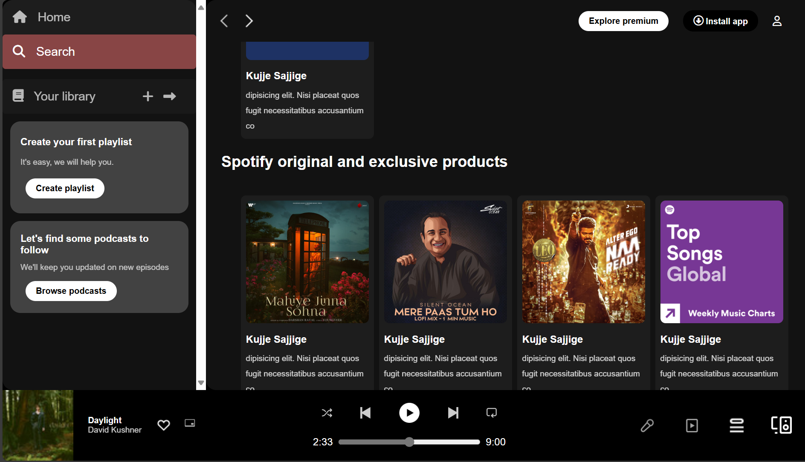

# Spotify Clone

A simple **Spotify Clone** built using only **HTML** and **CSS**.  
This project replicates the look and feel of the Spotify web player interface.

## Features

- Custom navigation bar
- Playlist and album sections
- Styled audio player controls (UI only, no functionality)

## Getting Started

1. Clone this repository.
2. Open `index.html` in your browser.

## Technologies Used

- HTML5
- CSS3

## Note

This project is for educational purposes and does **not** include backend functionality or actual music playback.

## Image

